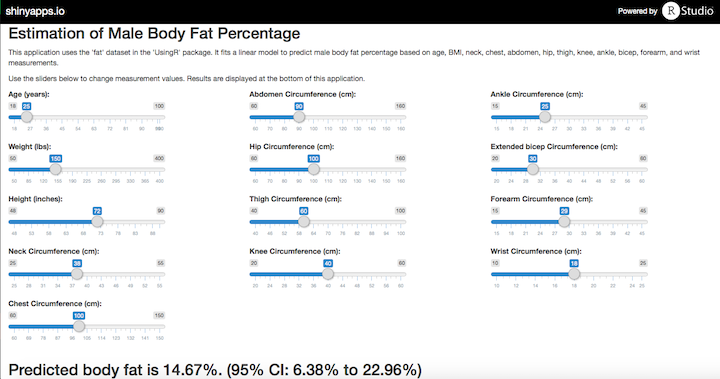

## Why Estimate Body Fat?

0. It is important to monitor body fat to maintain and adjust ones health and lifestyle. 
1. Body fat is not an easily measured value.  It typically requires special measurement devices.
2. Using easily-measured data from the 'UsingR' 'fat' dataset, we can run a multivariate linear model to estimate body fat.  

--- .class #id 

## How It's Done

First fit a multivariate linear model to predict body fat percentage using the following predictors:
* Age
* BMI (using height and weight)
* Neck, Chest, Abdomen, Hip, Thigh, Knee, Ankle, Bicep, Forearm, Wrist Circumference

--- .class #id .codefont .outfont

## The Model

```r
library(UsingR)
data(fat)
simpleRegression <- lm(body.fat ~ age + BMI + neck + chest +  abdomen + hip + 
                               thigh + knee + ankle + bicep + forearm + wrist, 
                       data = fat)
summary(simpleRegression)
```

```
## 
## Call:
## lm(formula = body.fat ~ age + BMI + neck + chest + abdomen + 
##     hip + thigh + knee + ankle + bicep + forearm + wrist, data = fat)
## 
## Residuals:
##     Min      1Q  Median      3Q     Max 
## -10.301  -2.583  -0.178   2.892  10.123 
## 
## Coefficients:
##             Estimate Std. Error t value Pr(>|t|)    
## (Intercept)   5.6955     7.1136    0.80  0.42413    
## age           0.0765     0.0287    2.67  0.00819 ** 
## BMI           0.2163     0.2373    0.91  0.36283    
## neck         -0.6002     0.2068   -2.90  0.00404 ** 
## chest        -0.1093     0.0905   -1.21  0.22840    
## abdomen       0.8370     0.0835   10.02  < 2e-16 ***
## hip          -0.3372     0.1171   -2.88  0.00433 ** 
## thigh         0.2341     0.1356    1.73  0.08570 .  
## knee         -0.1293     0.2216   -0.58  0.56001    
## ankle         0.0718     0.2046    0.35  0.72601    
## bicep         0.0839     0.1579    0.53  0.59549    
## forearm       0.4280     0.1858    2.30  0.02211 *  
## wrist        -1.7114     0.4865   -3.52  0.00052 ***
## ---
## Signif. codes:  0 '***' 0.001 '**' 0.01 '*' 0.05 '.' 0.1 ' ' 1
## 
## Residual standard error: 4 on 239 degrees of freedom
## Multiple R-squared:  0.744,	Adjusted R-squared:  0.731 
## F-statistic:   58 on 12 and 239 DF,  p-value: <2e-16
```

--- .class #id

## The App
The app looks like the following ([link](https://tekquon.shinyapps.io/Data_Products_Shiny)):


